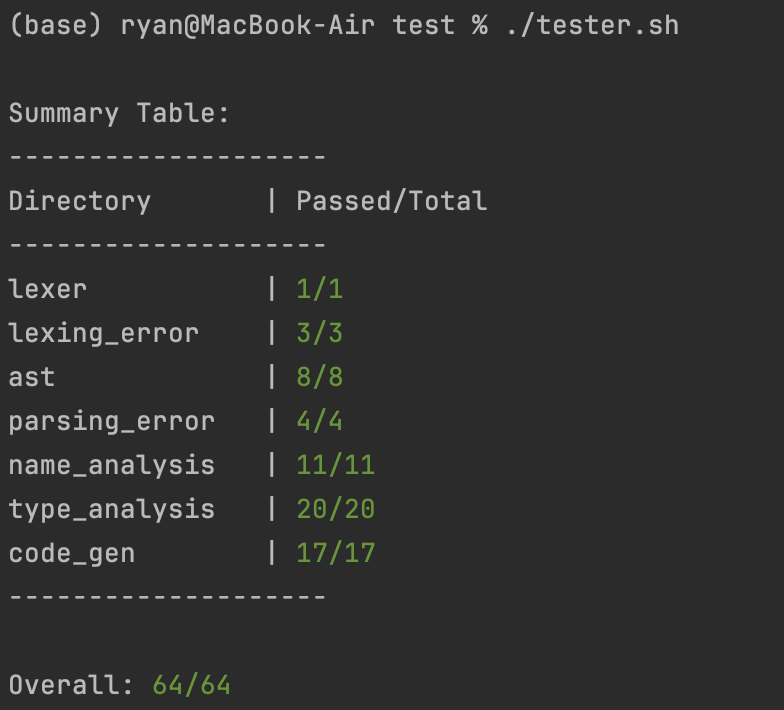

## C compiler

This is a compiler for a subset of C, built from scratch. It translates C code into x86 assembly, unfortunately only runs MacOS Intel cpu for now.

A compiler works in stages: it takes human-readable code, checks that it’s valid, and turns it into low-level instructions the CPU understands. This project implements those steps manually, without relying on existing compiler frameworks.

This project is educational, built to learn how programming languages work, mostly as a toy compiler project. While functional, there's room for optimizations, particularly in register allocation :)

### Supported C Features

-Variables, functions, structs, pointers, and arrays  
-Control flow: `if`, `while`, `break`, `continue`  
-Expressions, function calls, and returns  
-Arithmetic, relational, and logical operations (unary and binary)  
-Basic types: `int`, `char`, and `void`

### Implemented Compiler Stages

**Lexing** – reads the raw source text and splits it into tokens (keywords, identifiers, symbols).  
 `int x = 5;` → `int`, `x`, `=`, `5`, `;`

**Parsing** – recursive descent parser builds an abstract syntax tree (AST) that represents the program’s structure.  
 `x = y + 1;` becomes a tree where the root is `=`, with `x` on the left and `+` as the right child.

**Semantic Analysis** – checks that names and types are valid before code generation.  
 Catches errors like using an undeclared variable or assigning a `char*` to an `int`.

**Code Generation** – walks the AST, assigns registers, and emits x86-64 assembly instructions.  
 `x = y + 1;` → `mov rax, [y]`, `add rax, 1`, `mov [x], rax`

### Testing
Each stage of the compiler is tested on its own and as part of the full pipeline.
Lexer tests check that text is split correctly into tokens. Parser tests confirm that valid code produces the right AST and invalid syntax fails cleanly. Semantic tests cover all type and scope rules, using both valid and intentionally broken programs to confirm errors are caught. Code generation is tested by compiling small programs, assembling them, running them, and checking their actual output matches the expected result.

You can run the tests using in the /test directory by running

     ./tester.sh

The test script runs the compiler on each test case (60+) and, for code-generation tests, it assembles the produced assembly with nasm, links it with ld, then runs the resulting x86_64 binary through Rosetta on Apple Silicon

The expected result of each test is displayed in a comment at the top of the file and parsed through grep.



### Running compiler:

    ./compiler <file.c>


Options:  
&emsp;-lexer (print lexer tokens)  
&emsp;-ast (print abstract syntax tree)

---

### Example fibonacci program:

Note: You need to have the print.c utilities file in your include path for the printing utilities to be available.
The easiest way is to have the `std/print.c` folder in the same path as the compiler

```
#include <std/print.c>

int fibonnaci(int n){
    if (n == 0){
        return 0;
    }
    if (n == 1){
        return 1;
    }
    return fibonnaci(n-1) + fibonnaci(n-2);
}

int main(){
    print_i(fibonnaci(20)); // 6765
    return 0;
}
```

AST:

    ./compiler fib.c -ast

```
Program (
    FuncDecl fibonnaci(VarDecl(int)) (int) (
        If ((n == 0)) (
            return( 0 )
        )
        If ((n == 1)) (
            return( 1 )
        )
        return( (Func Call fibonnaci ((n - 1) ) + Func Call fibonnaci ((n - 2) )) )
    )
    FuncDecl main() (int) (
        Func Call print_i (Func Call fibonnaci (20 ) )
        return( 0 )
    )
)
````

Generated IR:

```
fibonnaci:
    push rbp
    mov rbp, rsp
    mov %2, rdi
    mov %3, 0
    mov %4, %2
    cmp %4, %3
    sete %4
    movzx %4, %4
    cmp %4, 1
    jne end3
    mov %5, 0
    mov rax, %5
    jmp ret2
end3:
    mov %6, 1
    mov %7, %2
    cmp %7, %6
    sete %7
    movzx %7, %7
    cmp %7, 1
    jne end4
    mov %8, 1
    mov rax, %8
    jmp ret2
end4:
    mov %9, 1
    mov %10, %2
    sub %10, %9
    mov rdi, %10
    call fibonnaci
    mov %11, rax
    mov %12, 2
    mov %13, %2
    sub %13, %12
    mov rdi, %13
    call fibonnaci
    mov %14, rax
    mov %15, %11
    add %15, %14
    mov rax, %15
    jmp ret2
ret2:
    mov rsp, rbp
    pop rbp
    ret

main:
    push rbp
    mov rbp, rsp
    mov %16, 20
    mov rdi, %16
    call fibonnaci
    mov %17, rax
    mov rdi, %17
    call print_i
    mov %18, rax
    mov %19, 0
    mov rax, %19
    jmp ret5
ret5:
    mov rsp, rbp
    pop rbp
    ret
```
